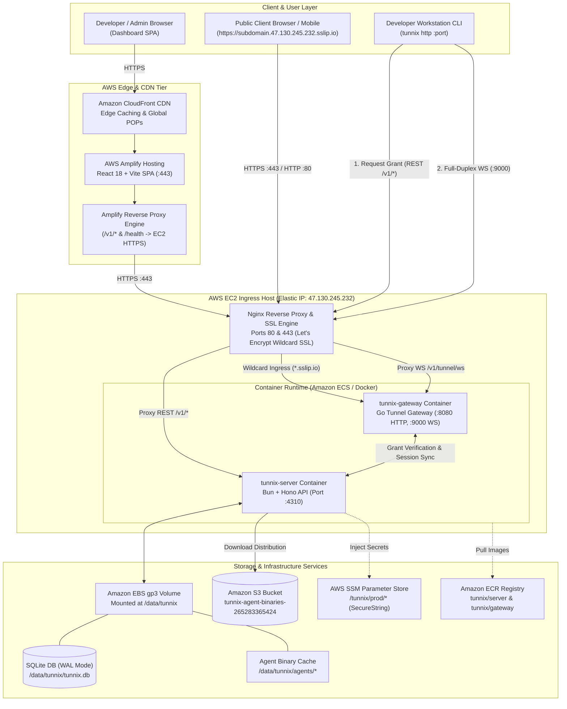

# Tunnix — Cloud & Production Deployment Architecture

This document provides a comprehensive technical guide to the production deployment and cloud infrastructure powering the **Tunnix** developer tunneling platform.

---

## ☁️ Cloud Architecture Overview

Tunnix uses a hybrid cloud topology designed for zero-latency tunneling throughput, global edge delivery, and secure containerized process isolation.



---

## 🏛️ Infrastructure Components & Specifications

### 1. Edge & Frontend Tier (AWS Amplify & CloudFront)
- **Service:** AWS Amplify Hosting (Branch: `prod`)
- **Domain:** `prod.d1jbmcf0n8m3v0.amplifyapp.com`
- **CDN:** CloudFront edge distribution with automated asset hashing, gzip/brotli compression, and zero-downtime cache invalidation.
- **Reverse Proxy Rules:**
  Amplify forwards API and health-check requests transparently to the backend host without triggering CORS preflights:
  ```json
  [
    {
      "source": "/v1/<*>",
      "target": "https://47.130.245.232.sslip.io/v1/<*>",
      "status": "200"
    },
    {
      "source": "/health",
      "target": "https://47.130.245.232.sslip.io/health",
      "status": "200"
    },
    {
      "source": "</^[^.]+$|\\.(?!(css|gif|ico|jpg|js|png|txt|svg|woff|woff2|ttf|map|json)$)([^.]+$)/>",
      "target": "/index.html",
      "status": "200"
    }
  ]
  ```

---

### 2. Compute & Network Ingress Tier (AWS EC2)
- **Instance Type:** AWS EC2 `t3.small` (Amazon Linux 2023 ECS-Optimized AMI)
- **Public IP:** `47.130.245.232` (Dedicated AWS Elastic IP)
- **Domain Mapping:** Wildcard DNS via `47.130.245.232.sslip.io` (matches all subdomains automatically without manual DNS configuration).
- **SSL / TLS Termination:**
  - Let's Encrypt Wildcard SSL certificates managed via Certbot.
  - TLSv1.2 & TLSv1.3 with forward secrecy ciphers.
- **Nginx Ingress Router (`deploy/nginx/aws-tunnix.conf`):**
  - **Port 80:** HTTP redirect & ACME challenge handler.
  - **Port 443 (Server Ingress):** Routes `/v1/*` REST API traffic to `http://127.0.0.1:4310`.
  - **Port 443 (Wildcard Subdomain Ingress):** Captures `~^(?<subdomain>[a-zA-Z0-9_-]+)\.47\.130\.245\.232\.sslip\.io$` and proxies directly to the Go Gateway on `http://127.0.0.1:8080` with `X-Forwarded-Subdomain` header.
  - **Port 443 & Port 9000 (WebSocket Ingress):** Upgrades `/v1/tunnel/ws` and `/tunnel-ws` connections to the Go Gateway WebSocket listener.

---

### 3. Containerized Application Tier (Docker / Amazon ECS)

Both services run as isolated Docker containers orchestrated via Amazon ECS (EC2 launch type):

| Container | Technology | Internal Port | Host Port | Purpose |
|---|---|---|---|---|
| **`tunnix-server`** | Bun 1.1 + Hono (TypeScript) | `4310` | `4310` | Control Plane REST API, Auth OTP, JWT Grant Authority, Admin Governance, Agent Binary Serving. |
| **`tunnix-gateway`** | Go 1.23 (`gorilla/websocket`) | `8080`, `9000` | `8080`, `9000` | High-concurrency Ingress Gateway. Translates HTTP requests to multiplexed binary WebSocket frames. |

#### Storage Mounts
- **Host Path:** `/data/tunnix` (AWS EBS gp3 volume)
- **Container Path:** `/data` (mounted in `tunnix-server`)
- **SQLite Database:** `/data/tunnix.db` configured with `PRAGMA journal_mode = WAL` (Write-Ahead Logging) and `busy_timeout = 5000` for concurrent read/write performance.
- **Binary Cache:** `/data/tunnix/agents/` holds static cross-platform CLI binaries (`tunnix-linux-amd64`, `tunnix-linux-arm64`, `tunnix-darwin-amd64`, `tunnix-darwin-arm64`, `tunnix-windows-amd64.exe`).

---

### 4. Binary Distribution & Object Storage (Amazon S3)
- **Bucket:** `tunnix-agent-binaries-265283365424` (Region: `ap-southeast-1`)
- **Distribution Paths:**
  - `s3://tunnix-agent-binaries-265283365424/agents/latest/`
  - `s3://tunnix-agent-binaries-265283365424/agents/<git-sha>/`
- **Access Policy:** Public read allowed for `agents/*` objects; secured with S3 Versioning enabled.

---

### 5. Secrets Management (AWS Systems Manager Parameter Store)
Production secrets are stored under `/tunnix/prod/*` as encrypted `SecureString` parameters and injected into ECS task definitions at startup:
- `/tunnix/prod/JWT_ACCESS_SECRET`
- `/tunnix/prod/JWT_REFRESH_SECRET`
- `/tunnix/prod/TUNNEL_GRANT_SECRET`
- `/tunnix/prod/INTERNAL_GATEWAY_SECRET`
- `/tunnix/prod/BREVO_API_KEY`
- `/tunnix/prod/TURNSTILE_SECRET_KEY`

---

## 🔄 End-to-End Data Pipelines & Network Flow

### 1. User Dashboard & Admin Flow
```
User Browser ──(HTTPS)──> CloudFront CDN ──> Amplify SPA
                               │
                       (API call /v1/*)
                               │
                               ▼
               EC2 Nginx Reverse Proxy (:443)
                               │
                               ▼
                tunnix-server Container (:4310)
                               │
                               ▼
                    SQLite DB (/data/tunnix.db)
```

### 2. Tunnel Registration Flow (CLI Agent)
```
1. Developer runs `tunnix login <token>`:
   Agent CLI ──(REST)──> /v1/agent/auth/login ──> Control Plane validates token.

2. Developer runs `tunnix http 3000`:
   Agent CLI ──(REST)──> /v1/tunnel/session:
     - Control Plane verifies user tunnel quota & reserved subdomain.
     - Control Plane generates signed 30-min HMAC Tunnel Grant JWT.
     - Returns Grant Token + WebSocket Endpoint URL.

3. Agent establishes WebSocket:
   Agent CLI ──(WSS)──> wss://47.130.245.232.sslip.io/v1/tunnel/ws
     - Nginx passes Upgrade header to Go Gateway (:9000).
     - Gateway validates Grant JWT against Control Plane.
     - Gateway registers active connection mapped to subdomain in memory.
```

### 3. Public Traffic Ingress & Frame Multiplexing Flow
```
1. External user visits https://app.47.130.245.232.sslip.io
2. Nginx terminates SSL, captures subdomain "app", forwards to Gateway HTTP (:8080).
3. Gateway looks up active tunnel for "app":
   - Assigns unique Request Correlation ID (UUIDv4).
   - Serializes HTTP request into a binary WebSocket frame.
   - Streams frame over persistent WebSocket to Agent CLI.
4. Agent CLI unpacks binary frame:
   - Dispatches HTTP request to local service (`http://localhost:3000`).
   - Captures local HTTP response status, headers, and payload.
   - Encodes response into binary WebSocket frame with matching Correlation ID.
   - Streams frame back to Gateway.
5. Gateway correlates response frame by Correlation ID and completes HTTP client request.
```

---

## 🚀 CI/CD Automation Pipelines (GitHub Actions)

All production deployments trigger automatically upon pushing to the `prod` branch:

| Workflow File | Trigger Path | Destination | Automated Actions |
|---|---|---|---|
| [`.github/workflows/deploy-client.yml`](../.github/workflows/deploy-client.yml) | `apps/client/**` | AWS Amplify | Triggers Amplify `RELEASE` job, compiles Vite bundle, deploys to global CloudFront edge. |
| [`.github/workflows/deploy-server.yml`](../.github/workflows/deploy-server.yml) | `apps/server/**`, `agent/**` | Amazon ECR & ECS | Multi-stage Docker build: compiles 5 Go agent binaries, bundles server, pushes to ECR, forces zero-downtime ECS deployment. |
| [`.github/workflows/deploy-gateway.yml`](../.github/workflows/deploy-gateway.yml) | `gateway/**` | Amazon ECR & ECS | Compiles static Go binary, builds minimal Alpine image, pushes to ECR, updates ECS service. |
| [`.github/workflows/build-agents.yml`](../.github/workflows/build-agents.yml) | `agent/**` | Amazon S3 | Cross-compiles binaries for 5 OS/CPU targets, uploads versioned + `latest` copies to S3. |
| [`.github/workflows/iac.yml`](../.github/workflows/iac.yml) | `infra/**` | GitHub Actions | Safe static validation mode (`terraform init -backend=false && terraform validate`). Zero resource mutations. |

---

## 🛡️ Security & Reliability Measures

1. **EBS Volume Isolation:** Database data persists independently of EC2 container lifecycles on `/data/tunnix`.
2. **Automated Database Backups:** Nightly SQLite backup script (`deploy/scripts/backup-db.sh`) snapshots the database using SQLite online backup API without locking active connections.
3. **No Root Execution:** Docker containers and systemd units execute under unprivileged service users (`tunnix`).
4. **Strict Rate Limiting:** Nginx connection limit zones protect ingress ports from SYN flood and DoS attacks.
5. **Short-Lived Grant Tokens:** Tunnel sessions use 30-minute HMAC tokens; revoked tunnels disconnect immediately.
